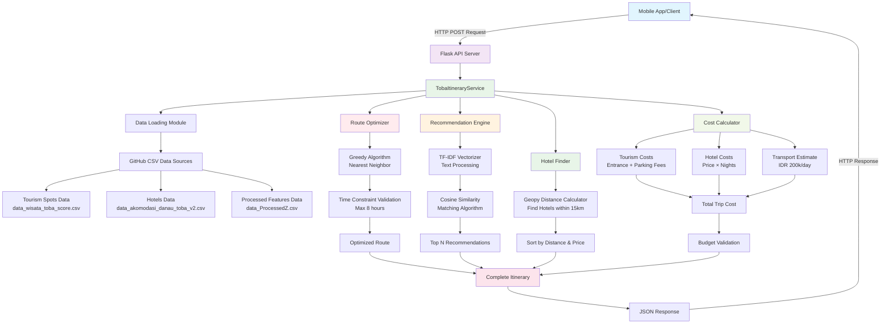
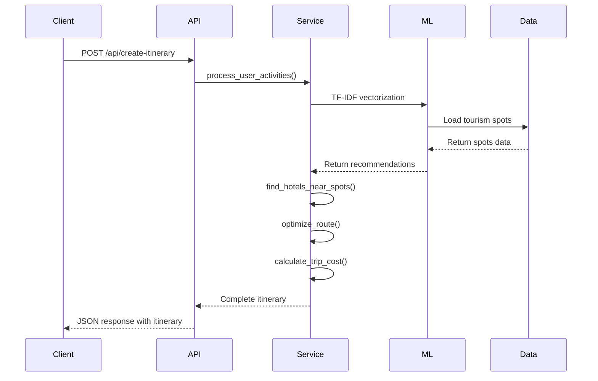

# Lake Toba Itinerary Generator API

A RESTful API service for generating personalized travel itineraries for Lake Toba, North Sumatra, Indonesia. This Flask-based application uses machine learning techniques to recommend tourism spots based on user preferences and optimizes travel routes while considering budget constraints.

## Features

- **Activity-based Recommendations**: Get tourism spot recommendations based on preferred activities
- **Smart Hotel Selection**: Find accommodations near selected tourism spots
- **Route Optimization**: Generate optimal travel routes with time and distance constraints
- **Budget Management**: Calculate trip costs and validate against user budgets
- **Complete Itinerary Generation**: Create full travel itineraries with one API call

## System Architecture



## Data Flow



## Installation

### Prerequisites

- Python 3.8+
- pip package manager

### Setup

1. **Clone the repository**
   ```bash
   git clone https://github.com/kevinyogap/itinerary_with_TSP
   cd lake-toba-itinerary-api
   ```

2. **Install dependencies**
   ```bash
   pip install -r r.txt
   ```

3. **Required packages**
   ```bash
   pip install flask flask-cors pandas numpy scikit-learn geopy
   ```

4. **Run the application**
   ```bash
   python app.py
   ```

The API will be available at `http://localhost:5000`

## API Documentation

### Base URL
```
http://localhost:5000/api
```

### Endpoints

#### 1. Health Check
```http
GET /api/health
```

**Response:**
```json
{
  "status": "healthy",
  "data_loaded": true,
  "timestamp": "2025-06-30T10:00:00"
}
```

#### 2. Get Activity Categories
```http
GET /api/activities
```

**Response:**
```json
{
  "success": true,
  "data": {
    "pemandangan": "Scenic Views",
    "fotografi": "Photography",
    "santai": "Relaxation",
    "camping": "Camping",
    "trekking": "Trekking",
    "berenang": "Swimming",
    "piknik": "Picnic",
    "aktivitas air": "Water Activities"
  }
}
```

#### 3. Get Tourism Recommendations
```http
POST /api/recommendations
```

**Request Body:**
```json
{
  "activities": ["pemandangan", "fotografi", "santai"],
  "top_n": 10
}
```

**Response:**
```json
{
  "success": true,
  "data": {
    "processed_activities": ["pemandangan", "fotografi", "santai"],
    "recommendations": [
      {
        "title": "Sipiso-piso Waterfall",
        "category": "pemandangan",
        "score": 0.85,
        "latitude": 2.9167,
        "longitude": 98.5167,
        "entrance_fee": 10000,
        "parking_fee": 5000
      }
    ],
    "total_count": 10
  }
}
```

#### 4. Find Hotels Near Spots
```http
POST /api/hotels
```

**Request Body:**
```json
{
  "tourism_spots": [
    {
      "title": "Sipiso-piso Waterfall",
      "latitude": 2.9167,
      "longitude": 98.5167
    }
  ],
  "max_distance_km": 15
}
```

#### 5. Calculate Trip Cost
```http
POST /api/calculate-cost
```

**Request Body:**
```json
{
  "tourism_spots": [...],
  "hotel": {...},
  "num_days": 3,
  "num_people": 2
}
```

#### 6. Optimize Route
```http
POST /api/optimize-route
```

**Request Body:**
```json
{
  "tourism_spots": [...],
  "hotel": {...},
  "max_hours": 8
}
```

#### 7. Check Budget
```http
POST /api/check-budget
```

**Request Body:**
```json
{
  "tourism_spots": [...],
  "hotel": {...},
  "num_days": 3,
  "num_people": 2,
  "budget": 2000000
}
```

#### 8. Create Complete Itinerary
```http
POST /api/create-itinerary
```

**Request Body:**
```json
{
  "activities": ["pemandangan", "fotografi"],
  "num_days": 3,
  "num_people": 2,
  "budget": 2000000
}
```

**Response:**
```json
{
  "success": true,
  "data": {
    "itinerary": {
      "activities": ["pemandangan", "fotografi"],
      "tourism_spots": [...],
      "hotel": {...},
      "route_info": {...},
      "num_days": 3,
      "num_people": 2
    },
    "costs": {
      "tourism_cost": 50000,
      "hotel_cost": 600000,
      "transport_cost": 600000,
      "total_cost": 1250000,
      "per_person_cost": 625000
    },
    "budget": 2000000,
    "within_budget": true,
    "budget_difference": 750000
  }
}
```

## Algorithm Details

### 1. Recommendation System
- **TF-IDF Vectorization**: Converts activity tags into numerical vectors
- **Cosine Similarity**: Measures similarity between user preferences and tourism spots
- **Fallback System**: Uses rating scores when similarity matching fails

### 2. Route Optimization
- **Greedy Algorithm**: Starts from hotel, visits nearest unvisited spot
- **Time Constraints**: Considers travel time (30 km/h avg) + visit time (1.5h per spot)
- **Distance Calculation**: Uses Geopy geodesic distance for accuracy

### 3. Cost Calculation
- **Tourism Costs**: Entrance fees + parking fees × number of people
- **Hotel Costs**: Price per night × (days - 1)
- **Transport Estimate**: IDR 200,000 per day (configurable)

## Data Sources

The API fetches data from GitHub-hosted CSV files:

1. **Tourism Spots**: `data_wisata_toba_score.csv`
   - Contains tourism locations with coordinates, categories, and pricing
   
2. **Hotels**: `data_akomodasi_danau_toba_v2.csv`
   - Hotel information with location and pricing data
   
3. **Processed Features**: `data_ProcessedZ.csv`
   - Pre-processed activity tags and categories for ML algorithms

## Configuration

### Activity Categories
The system supports 8 main activity types:
- `pemandangan` (Scenic Views)
- `fotografi` (Photography)
- `santai` (Relaxation)
- `camping` (Camping)
- `trekking` (Trekking)
- `berenang` (Swimming)
- `piknik` (Picnic)
- `aktivitas air` (Water Activities)

### Default Parameters
- **Hotel Search Radius**: 15 km from tourism spots
- **Daily Activity Hours**: 8 hours maximum
- **Average Travel Speed**: 30 km/h
- **Visit Time per Spot**: 1.5 hours
- **Daily Transport Cost**: IDR 200,000

## Error Handling

All endpoints return consistent error responses:

```json
{
  "success": false,
  "error": "Error description",
  "traceback": "Detailed error trace (in debug mode)"
}
```

Common HTTP status codes:
- `200`: Success
- `400`: Bad Request (missing required fields)
- `404`: Not Found (no data available)
- `500`: Internal Server Error

## Development

### Project Structure
```
lake-toba-api/
├── app.py              # Main Flask application
├── requirements.txt    # Python dependencies
├── README.md          # This file
└── docs/              # Additional documentation
```

### Running in Development Mode
```bash
export FLASK_ENV=development
python app.py
```

### CORS Configuration
The API includes CORS support for cross-origin requests, enabling mobile app integration.

## Deployment

### Production Considerations
1. **Environment Variables**: Set `FLASK_ENV=production`
2. **WSGI Server**: Use Gunicorn or uWSGI instead of development server
3. **Database**: Consider migrating from CSV to proper database for production
4. **Caching**: Implement caching for frequently accessed data
5. **Rate Limiting**: Add API rate limiting for production use

### Docker Deployment
```dockerfile
FROM python:3.9-slim
WORKDIR /app
COPY requirements.txt .
RUN pip install -r requirements.txt
COPY . .
EXPOSE 5000
CMD ["gunicorn", "--bind", "0.0.0.0:5000", "app:app"]
```

## Contributing

1. Fork the repository
2. Create a feature branch
3. Make your changes
4. Add tests if applicable
5. Submit a pull request

## License

This project is licensed under the MIT License - see the LICENSE file for details.

## Support

For questions or support, please contact the development team or create an issue in the repository.

---

**Note**: This API is designed for Lake Toba tourism specifically. The recommendation algorithms and data are optimized for the North Sumatra region.
